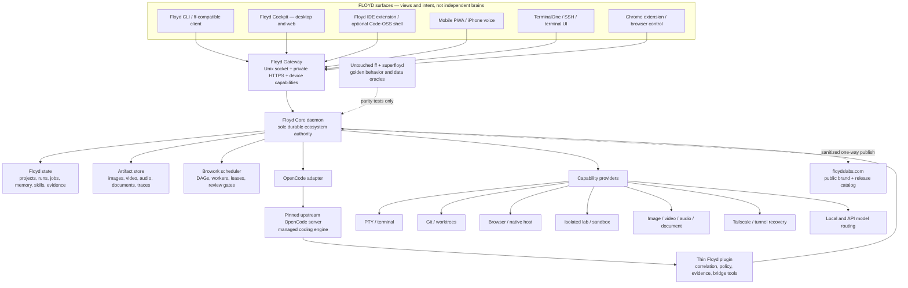

<!-- markdownlint-disable MD013 MD060 -->

# FLOYD Workstation — Official Ecosystem Blueprint

**Plan version:** 1.0  
**Date:** 2026-07-11  
**Truth state:** official implementation plan; architecture is selected, implementation has not begun  
**Delivery boundary:** private to Douglas and explicitly invited teammates

## Central hub location — selected

The canonical local FLOYD hub is **not** the current iCloud-managed Documents workspace and is **not** the constrained internal system disk.

```text
/Volumes/Storage/FLOYD_WORKSTATION     provisioned private Git working tree and source/control hub
/Volumes/Storage/FLOYD_RUNTIME         provisioned daemon database, event ledger, artifacts, media, backups
```

- `/Volumes/Storage/FLOYD_WORKSTATION` is the future checkout of private remote `LegacyAI-FloydsLabs/floyd`.
- `/Volumes/Storage/FLOYD_RUNTIME` is never committed. It holds the persistent Core state and high-volume media/artifact store.
- The internal disk holds only minimal launch metadata/Keychain references. It is not an artifact cache or fallback runtime location.
- If `/Volumes/Storage` is absent, Floyd reports a hard degraded/offline state and does not silently write a second divergent runtime to the internal disk.
- The current `/Users/douglastalley/Documents/Floyd_EcoSystem` directory is an iCloud-managed planning workroom created on 2026-07-11 with its `.git` directory. It is not the canonical hub. Its planning documents will be independently copied into the selected hub only during the authorized Phase A setup.

## Executive decision

FLOYD should become one private, local-first workstation platform with **one first-party durable authority** and many surfaces.

The selected design is:

1. **Floyd Core** is a new persistent daemon and the sole ecosystem control plane. It owns identity, projects, runs, jobs, agent scheduling, memory, skills, artifacts, policy, leases, evidence, device access, provider credentials, and process supervision.
2. **Current upstream OpenCode** is the supervised coding engine. FLOYD uses the whole supported platform—server, SDK, sessions, child sessions, tools, permissions, events, MCP, LSP, and plugins—rather than wrapping its CLI or maintaining a deep fork.
3. A **thin, stateless Floyd OpenCode plugin and SDK adapter** bind OpenCode work to Floyd actors, projects, runs, worktrees, permissions, evidence, and providers.
4. **CodeNomad is the primary cockpit baseline**, copied independently and kept upstream-compatible. Its useful desktop/web/mobile/remote UX becomes a Floyd client; it does not become a second control plane.
5. The existing CLI, terminal, desktop, browser, voice, mobile, IDE, media, and orchestration projects become focused clients, providers, or donors over the same contracts. None keeps its own competing brain.
6. The installed `ff` and `superfloyd` paths remain untouched golden behavioral oracles until a side-by-side replacement passes explicit parity and recovery gates.
7. Every named original remains immutable. Selected code is admitted only through verified independent copies—never hardlinks, writable symlinks, or edits in place.
8. `floydslabs.com` remains the public front porch and optional isolated demo/catalog. It is never an ingress path to the private workstation.

**My opinion:** OpenCode is the right modern coding substrate, but it is not the whole organism. Making it the coding engine while Floyd Core owns workstation-wide continuity is more robust than resurrecting v5, deep-forking CRUSH/OpenCode, or hiding fragmentation behind symlinks.

## The governing idea

> One creature does not mean one process, one language, or one database. It means one identity model, one supervisor, one policy boundary, one lifecycle, one contract family, and one source of durable ecosystem truth.

Every surface must see the same:

- projects and workspaces;
- human, device, and agent identities;
- sessions, runs, jobs, approvals, and stop state;
- memory and skills;
- Git repositories and worktree leases;
- terminal, browser, lab, and provider capabilities;
- media and document artifacts;
- evidence, cost, health, and recovery state.

## Why this option wins

| Option | Decision | Reason |
|---|---|---|
| Symlink the existing projects together | Reject | It preserves conflicting state, ports, auth, schemas, retries, and process owners while concealing the conflict. |
| Restore the corrupted v5 tree as the core | Reject | The only matching source tree is user-confirmed corrupt and does not reproduce the good deployed binary. |
| Deep-fork CRUSH / archived Go OpenCode | Reject | It repeats the divergence that caused the current estate; modern CRUSH also introduces license and upstream-maintenance concerns. |
| Deep-fork current TypeScript OpenCode | Reject by default | The supported server, SDK, plugin, event, permission, and agent seams cover the required coding integration. A fork is justified only by a written, tested gap. |
| Use OpenCode alone | Reject | It does not provide the required global device identity, durable Browork leases, cross-engine artifacts, media pipeline, connectivity authority, or workstation supervision. |
| Rewrite everything from scratch | Reject | It discards proven UX and capability code while recreating mature OpenCode functions. |
| **Floyd Core + managed upstream OpenCode + Floyd plugin + CodeNomad cockpit** | **Select** | It gives FLOYD durable identity and control without forfeiting upstream coding-platform velocity. |

## Target architecture



## Authority boundaries

| Layer | Owns | Must not own |
|---|---|---|
| Floyd Core | actors/devices, projects, global sessions, runs/jobs, agents, skills, memory, worktree/sandbox leases, artifacts, budgets, policy decisions, evidence, provider credentials, health and recovery | editor rendering, raw PTY rendering, OpenCode's internal model loop |
| OpenCode engine | coding-engine sessions/messages, model turns, child coding sessions, compaction, coding tools, LSP/formatters, diffs, engine MCP, provider streaming/retry | global identity, durable Browork scheduling, media registry, tunnels, device auth, workstation lifecycle |
| Floyd OpenCode plugin | correlation IDs, policy preflight, normalized events/evidence, typed bridge tools, context injection | authoritative database, credentials, independent queues or retries |
| Browork scheduler | run DAG, worker/worktree leases, dependency state, retries, stop conditions, review/merge gates | editing the same worktree from multiple workers |
| Providers | one bounded capability and its operational state | global sessions, user identity, cross-provider orchestration |
| Clients | presentation, input, local view state, approval UI | provider keys, durable job authority, direct unrestricted shell/filesystem access |
| Public website | brand, story, verified release manifest, screenshots, selected public docs/catalog | private credentials, live workstation endpoints, team sessions, raw MCP/tool access |

### Global and engine-session mapping

Floyd Core creates the canonical identifiers and maps engine-local records beneath them:

```text
floyd_project_id
  └── floyd_session_id
      └── floyd_run_id
          └── floyd_job_id
              ├── opencode_project_id
              ├── opencode_session_id
              ├── opencode_message_id
              ├── worktree_lease_id
              └── artifact/evidence references
```

OpenCode remains authoritative for its detailed coding transcript. Floyd Core remains authoritative for why it ran, who authorized it, what resources it held, what it produced, whether it completed, and how it recovers.

## Canonical surfaces

### 1. Floyd Cockpit — primary desktop/web surface

- Begin from an independent, pinned CodeNomad copy.
- Preserve multi-workspace, remote access, sessions, voice, worktrees, files/diffs, notifications, SideCars, and desktop packaging.
- Replace or subordinate CodeNomad's workspace/auth/process ownership to the Floyd Gateway.
- Add Projects, Browork, Agents, Skills, Memory, Artifacts/Studio, Terminals, Git, Devices, Providers, Costs, Health, and Evidence views.
- Use the Floyd Labs color/identity system with restrained productivity defaults; the user must be able to work for ten hours without the marketing page shouting at them.

### 2. Floyd CLI

- A new compatibility-aware client, not a renamed daemon.
- Preserve the interaction quality of `ff` and `superfloyd`; repair ASCII presentation only in the new/copy-owned client.
- Default action attaches to Floyd Core and a persisted project/session.
- Offer explicit commands for project, run, agent, skill, memory, artifact, Git, provider, device, health, and recovery state.
- Never silently start a second authority when the daemon is unreachable.

### 3. Floyd IDE

- First delivery: a private Floyd extension for supported VS Code/Code-OSS that connects to Floyd Core/OpenCode.
- Later option: a rebuilt, pinned Code-OSS shell with Floyd bundle IDs, data directories, protocol, update channel, signing, and telemetry policy.
- Do not ship the current CURSE'M bundle as the canonical IDE; it is a reference package with mixed Microsoft/Floyd identity and no maintainable source.

### 4. Mobile, voice, and remote

- MWIDE and the existing PWA donate the responsive project/editor/workflow experience.
- TerminalOne donates the focused terminal UX.
- iPhone Dispatcher donates voice normalization, confirmation, transcript, and outbox concepts.
- Primary route: Tailscale/private overlay plus device pairing and scoped capability token.
- SSH remains a host-authenticated transport into the CLI/terminal surface, not a second session database.
- Public ngrok is break-glass only, explicitly enabled, time-limited, and visible in health state.

### 5. Browser control

- Chrome extension communicates through a signed native-messaging host or private gateway capability.
- TTY Bridge donates native framing, OSC parsing, accessibility/browser tools, PTY supervision, and media capture patterns.
- Eliminate blind port scans, unauthenticated WebSockets, environment logging, direct-provider fallback, and arbitrary shell/file proxying.

### 6. Multimedia Studio

- DesktopWeb contributes the broad media workspace and adapters; FloydsLabsStudio contributes voice audition/transcript UX.
- Floyd Core owns every media job and artifact. Providers are replaceable adapters for local or API image, video, audio, and document engines.
- Artifacts are content-addressed, provenance-tagged, resumable, previewable from every surface, and attachable to projects/sessions.
- No UI keeps provider keys or treats browser object URLs/localStorage as durable media storage.

## Core data model

| Entity | Purpose |
|---|---|
| `Actor` / `Device` | Human, teammate, agent, client, and machine identity plus capability grants |
| `Project` | Stable project identity, roots, repositories, policies, preferred models, sessions, and artifacts |
| `Session` | Cross-surface continuity container; may reference one or more engine sessions |
| `Run` | User goal or workflow execution with plan, budget, stop conditions, and overall state |
| `Job` | Durable unit of work with dependencies, retry policy, idempotency key, and lease |
| `AgentSpec` / `AgentExecution` | Versioned role/model/tools/permissions and one concrete execution |
| `SkillVersion` | Immutable skill package digest, permissions, compatibility, tests, and evaluation state |
| `MemoryItem` | Scoped, source-attributed, inspectable memory with project/personal/session lifetime |
| `Artifact` | Content-addressed output plus MIME type, provenance, lineage, preview, and retention |
| `Lease` | Exclusive ownership of worktree, PTY, sandbox, device, or other mutable resource |
| `PolicyDecision` | Actor, requested capability, decision, reason, scope, expiry, and evidence |
| `EvidenceEvent` | Append-only observable action/result record with correlation IDs and artifact references |
| `ProviderProfile` | Vendor/model route, subscription/PAYG/local billing class, region, credential reference, quotas, capabilities, approval, and fail-closed fallback |

### Required action and observation envelopes

```text
ActionRequest
  id, actor_id, device_id, project_id, session_id
  run_id?, job_id?, capability, input, deadline
  idempotency_key, requested_permissions, correlation_id

ActionObservation
  phase: queued | leased | running | waiting_review | terminal
  status: success | warning | error
  summary, next_actions[], artifacts[], evidence[]
  error?: { code, retriable, recovery, stop_reason }
```

The lifecycle phase and result status are separate. A queued job is not a successful job; a completed tool call can still produce a warning.

## Persistence and recovery

- Begin with a single local SQLite WAL database for Floyd Core plus a content-addressed artifact directory. Keep the schema portable so Postgres can be added for a team host later without changing contracts.
- Store the data root under a dedicated `0700` directory; databases, logs, exports, and tokens default to `0600`.
- Store secrets only as Keychain or external credential-broker references. Never put API keys in browser storage, Git, OpenAPI examples, or world-readable config.
- Maintain an append-only event/outbox journal. Every external side effect uses an idempotency key; recovery replays observation, not the side effect blindly.
- Persist job dependencies, attempts, leases, heartbeats, stop conditions, and provider operation IDs so restart recovery is deterministic.
- Back up OpenCode through supported export/backup boundaries and store its engine-session mapping. Do not make Floyd Core share or mutate OpenCode's live database.
- Snapshot golden `ff`/`superfloyd` state only with SQLite's backup API or a verified offline copy. Never point new code at the live oracle databases.
- Provide user-visible export, restore, inspect, redact, and delete paths for sessions, memory, and artifacts.

## Skills, agents, and memory

### Skills

Canonical skills are real packages, not titles in a prompt or rows on a website:

```text
skills/<skill-name>/
  SKILL.md
  skill.yaml          # version, digest, compatibility, permissions, owners
  scripts/            # optional deterministic helpers
  tests/              # contract and fixture tests
  evals/              # behavioral evaluation cases
  references/         # only what the skill routes to
```

- Floyd Core owns the signed/versioned catalog and test state.
- Build adapters generate OpenCode, `.agents`, and other harness discovery layouts from the canonical packages.
- Load on demand; do not inject the entire catalog into every context.
- A website badge such as `Verified` is generated only from a release manifest containing passing tests/evals and a digest.

### Agents and Browork

- `AgentSpec` is distinct from a skill. It defines role, prompt, model policy, tool/skill grants, step limit, budget, escalation, and stop conditions.
- Browork compiles a goal into a run DAG and assigns jobs to agent executions.
- Coding workers receive separate Git worktrees and OpenCode child/peer sessions. No two agents write the same working tree.
- Workers publish evidence and artifacts; a reviewer/verifier gate decides promotion or merge.
- Lease expiry never implies success. Lost workers are observed, reconciled, and retried only when the action is idempotent.
- FCCLI's approval/checkpoint ideas, COHORT's leases/audit, DeerFlow's middleware/checkpointer, Agency's workflow templates, and ANVIL's hard-stop vocabulary are donors—not independent schedulers.

### Memory

- Separate transient session context, project memory, personal preferences, episodic evidence, and reusable knowledge.
- Every memory item records source, scope, confidence, created/last-used time, sensitivity, and deletion/export state.
- Retrieval must disclose why an item was selected and must never silently turn website copy or README claims into factual memory.
- Floyd's personality may shape presentation; it may not rewrite evidence, permissions, schemas, or failure states.

## End-to-end process flows

### Boot and attach

1. `launchd` starts Floyd Core under one exclusive instance lock.
2. Core verifies data permissions, schema, event journal, leases, provider registry, and recovery queue.
3. Core starts or attaches to the pinned loopback OpenCode worker with generated local credentials and the Floyd plugin.
4. Plugin and provider processes prove version/digest/capabilities in a handshake.
5. Desktop, CLI, IDE, mobile, browser, and terminal clients attach to the Floyd Gateway and subscribe to the same event stream.
6. Any failed dependency appears as degraded health with one bounded recovery action; no client silently creates a replacement authority.

### Coding task

1. A client sends an `ActionRequest` for a project/session.
2. Core authenticates actor/device, evaluates policy/budget, and acquires a workspace or worktree lease.
3. The OpenCode adapter creates or resumes the mapped engine session and submits the turn through the SDK.
4. The Floyd plugin correlates events and asks Core before sensitive tool execution.
5. OpenCode performs the coding loop; provider/Git actions emit normalized observations and evidence.
6. Core persists run/job state and broadcasts diffs, approvals, costs, and artifacts to every attached surface.
7. Completion requires the requested verification evidence; a model's assertion alone cannot close the job.

### Browork multi-agent task

1. User approves a versioned run plan, budget, risk profile, and merge policy.
2. Core creates the run DAG and exclusive worktree/sandbox leases.
3. Browork starts isolated OpenCode sessions with scoped AgentSpecs and skills.
4. Workers run in parallel only on independent resources; shared-file work is serialized or merged through an explicit integration job.
5. Reviewers consume diffs, tests, evidence, and artifacts—not private chain-of-thought.
6. Merge/promotion is a typed Git action with an approval gate and rollback reference.
7. Core releases leases and records terminal state only after evidence-backed verification.

### Media task

1. A surface submits a media job with prompt, inputs, provider policy, budget, and artifact requirements.
2. Core selects a local/API provider and stores the external operation ID before polling.
3. Outputs stream to the artifact store with hashes, MIME metadata, source inputs, model/provider, cost, and lineage.
4. The same artifact appears in Cockpit, CLI, IDE, mobile, and project history.
5. Cancellation/restart reconciles provider state and never re-bills blindly.

### Terminal, Git, browser, and remote task

1. The device presents an actor-bound capability token over Unix socket, SSH, or private HTTPS.
2. Core checks project, path, command, host, and expiry policy.
3. A single bounded provider performs the action: PTY, Git/worktree, native browser host, or lab.
4. Structured observations, recordings/diffs where appropriate, and redacted logs return through Core.
5. Mobile/remote approval can grant one action, a narrow pattern for one session, or reject; no broad bearer token silently becomes workstation root.

## Security and privacy baseline

- Private Git repositories do not make a privileged workstation safe by themselves.
- The canonical OpenCode profile starts strict: deny or ask by default for shell, external directories, deletion, credentials, network, browser, Git mutation, and host control. `--auto` is prohibited for normal operation.
- OpenCode stays on loopback behind Floyd Core; its Basic auth is not exposed as the team/device model.
- Team/mobile access uses Tailscale/private networking, paired devices, short-lived scoped tokens, revocation, and a visible kill switch.
- Public tunnels are explicit break-glass, bounded by TTL and capability, and automatically closed/reported.
- Provider keys live in Keychain/credential broker and are injected only into the scoped provider process.
- Plugin and upstream dependencies are pinned by tag, commit, asset hash, lockfile, license, and compatibility test. No privileged startup-time install from floating package versions.
- Browser native messaging replaces local port scanning and unauthenticated WebSockets.
- Host and lab operations have explicit mount/secret/network boundaries; the lab is a provider, never a control plane.
- All destructive Git/filesystem operations require typed scope, preview where possible, and recovery metadata.
- Logs and OSC/native messages are schema-limited and redacted; raw session context is never smuggled into terminal escape sequences.

### Immediate hardening boundary discovered during planning

These are urgent follow-on actions, not changes made by this planning pass:

1. The public Floyd Labs OpenAPI document contains a redacted credential-shaped shared-password example. Remove it and rotate the corresponding secret if it has ever been valid. Do not test or reuse it.
2. Public `/skills` and `/metrics` endpoints currently return data without authentication despite conflicting documentation/security declarations. Decide what is intentionally public, enforce the contract, and remove operational metrics from public access.
3. Replace public shared-password-to-JWT authentication and wildcard API CORS with explicit per-client credentials and an isolated public-demo boundary.
4. Current local OpenCode config contains literal API-key fields in a `0644` file; rotate/migrate them to supported auth/Keychain and set a strict permission profile.
5. Existing Floyd/OpenCode session databases observed as `0644` or `0666` must be permission-hardened during an approved maintenance window after verified backups.

## Public website and Git ownership

### Website

Keep `floydslabs.com` as the brand/story/catalog surface. Its best north star—“AI that belongs to you, not shareholders”—matches the architecture.

Revise its runtime truth model:

- Replace hard-coded and contradictory counts with a one-way sanitized release manifest.
- Use `Verified`, `Beta`, `Prototype`, `Planned`, or `Historical`; link each `Verified` claim to evidence.
- Say “No Floyd subscription,” not unconditional `$0/month`; model APIs, hosting, electricity, and hardware can still cost money.
- Distinguish public experiments/open-source projects from the private Floyd Workstation.
- Keep any public demo in a disposable environment with separate identity, keys, storage, providers, and no route to the workstation.
- The site never receives private session credentials or calls the private gateway.

### GitHub

- Organization owner: `LegacyAI-FloydsLabs`.
- Create one new **private** canonical monorepo, recommended name `LegacyAI-FloydsLabs/floyd`.
- Check that private monorepo out at `/Volumes/Storage/FLOYD_WORKSTATION`; keep its live runtime/artifacts separately at `/Volumes/Storage/FLOYD_RUNTIME`.
- Keep infrastructure/signing/machine secrets in a separate private `floyd-infra` repository only if access separation requires it.
- Keep immutable provenance/manifests in a private `floyd-archive`; do not dump unsafe live databases or secrets into Git.
- Keep the public site in a separated public repository only after operational API/auth code is isolated and reviewed.
- The ten currently public organization repositories and two public personal backup repositories remain existing public state. Do not rewrite, delete, or change visibility without an explicit preservation and settings plan; prior exposure cannot be undone.

## Canonical repository layout

```text
floyd/                              # private canonical monorepo
├── apps/
│   ├── cockpit/                    # CodeNomad-derived desktop/web shell
│   ├── mobile/                     # MWIDE/PWA-derived client
│   ├── ide-extension/              # Floyd IDE integration
│   └── launcher/                   # signed macOS launcher/menu-bar status
├── clients/
│   ├── cli/                        # ff/superfloyd-compatible client
│   ├── terminal/                   # TerminalOne presentation client
│   └── browser-extension/          # scoped Chrome surface
├── core/
│   ├── daemon/                     # durable authority and gateway
│   ├── browork/                    # run DAG and worker scheduler
│   └── persistence/                # events, jobs, memory, artifacts, leases
├── engines/
│   └── opencode/                   # pinned launcher/adapter; no hidden fork
├── plugins/
│   └── opencode-floyd/             # stateless policy/evidence/bridge plugin
├── providers/
│   ├── terminal/
│   ├── git/
│   ├── browser/
│   ├── media/
│   ├── models/
│   ├── lab/
│   └── connectivity/
├── packages/
│   ├── contracts/
│   ├── sdk/
│   ├── skills/
│   ├── agents/
│   ├── brand/
│   ├── evidence/
│   └── compatibility/
├── tests/
│   ├── contract/
│   ├── crash-recovery/
│   ├── parity/
│   ├── security/
│   └── end-to-end/
├── docs/
│   ├── adr/
│   ├── runbooks/
│   ├── threat-model/
│   └── donor-manifests/
└── intake/                         # independently copied donors; not blindly committed
```

Recommended first-party substrate: strict TypeScript on a pinned Node LTS runtime because the current OpenCode SDK/plugin boundary, CodeNomad, and most strong UI/provider donors are TypeScript. Use Go only where a fresh small native/compatibility utility materially wins; use isolated Python workers for provider ecosystems that require Python. Language choice never creates a second authority.

## Component disposition matrix

| Component | Final role |
|---|---|
| Live `ff` | **Preserve untouched** as primary behavior/data oracle; snapshot safely and build parity tests around it. |
| Live `superfloyd` | **Preserve untouched** as second CLI oracle; borrow behavior, correct ASCII only in new client code. |
| `floyd-v5-backup-2026-04-16` | **Quarantine** as corrupt forensic lineage; never a donor, even though its ancestry helps explain the binary. |
| FLOYD Extension for Chrome | **Extract** typed browser/vision tools and brand assets; retire the competing runtime/ports/provider fallback. |
| Floyd TTY Bridge for Chrome | **Adopt as capability donor** for native framing, OSC, PTY, accessibility/browser, xterm, audio/video, and tests; quarantine unsafe proxy paths. |
| FLOYD MOBILE PWA + ngrok | **Adopt as mobile presentation donor** after removing auth, cancel, Git-command, cache, and tunnel ownership. |
| FloydDesktopWeb-v2 | **Extract** desktop/media UI and adapters; retire its unauthenticated backend and private state. |
| FCCLI | **Extract** planning approval, ledger, checkpoints, and selected worktree/UI concepts; it is a scaffold, not a runtime. |
| floyd-harness | **Extract** hardened provider-facade patterns; retire placeholder MCP and independent runtime. |
| floyd-sandbox | **Forensic donor container**; inspect selected Deployable/next files through independent copies, never adopt wholesale. |
| FLOYD WRAPPER | **Extract** Zod action/result schemas, registry, and checkpoint ideas; retire standalone agent runtime. |
| INK SANDBOX | **Reference/extract** theme and native framing only; retire agent/runtime. |
| iPhone-Dispatcher | **Extract** voice normalization, confirmation, transcript, provider adapter, and outbox; retire ports/launchd/tmux authority. |
| FloydSkills | **Content quarry**; rewrite selected skills into tested canonical packages rather than bulk-importing claims. |
| TerminalOne | **Adopt thin terminal client UX**; retire its unauthenticated backend/job ownership. |
| terminal-control-center | **Extract** cockpit, typed LLM action, and output-analysis concepts; retire services/scheduler. |
| MWIDE | **Adopt mobile IDE/PWA UI donor**; quarantine privileged server, browser PATs, and host execution. |
| FloydsLabsStudio | **Extract voice/media audition UX**; retire standalone client-key prototype. |
| deerflow | **Extract selectively** lazy skill loading, middleware, checkpointer, and sandbox-provider patterns; never adopt the broken 7.4 GB tree wholesale. |
| COHORT | **Primary terminal/policy donor** for PTY, `/api/do`, relay leases, audit/memory, MCP proxy, and TeamDeck; do not retain its daemon. |
| FLOYD _THE_AGENCY | **Extract** WorkflowSpec vocabulary/templates as compiler fixtures; retire runtime claims. |
| Floyd_The_ANVIL | **Reference** evidence, heartbeat, idempotency, budget, hard-stop, and rollback vocabulary; no runtime adoption. |
| Opencode_Customizer | **Extract requirements, workflow checks, and `AsciiSF.txt`**; quarantine stale claims and retire the documentation-only folder as a project root. |
| FLOYD CODE.app | **Preserve icon/launch intent; retire package**; replace the hard-coded Terminal AppleScript with a signed daemon-aware launcher. |
| FLOYD CURSE'M.app | **Reference only** for desired IDE behavior; rebuild from upstream source or ship an extension, never adopt the packaged bundle as source. |
| Current upstream OpenCode | **Adopt as pinned managed coding engine** through server/SDK/plugin contracts; no deep fork without a proven gap. |
| CodeNomad | **Adopt as cockpit baseline after independent copy and source/security audit**; strip control-plane ownership. |
| `floydslabs.com` / FloydTheWebsite | **Preserve brand and catalog; revise truth states; decouple/quarantine public auth/runtime from workstation.** |
| `LegacyAI-FloydsLabs` org | **Canonical owner** for a new private repo; public repos remain donors/products, not automatically trusted core code. |
| `CaptainPhantasy/floyd-wrapper` | **Public provenance backup**; mirror/preserve before any later visibility/archive action, then selectively import verified code. |
| `CaptainPhantasy/floyd-v5` | **Public quarantined provenance**; never override the corrupt-source boundary or disturb golden binaries. |

Public organization repositories `aterm`, `control-center`, `Legacy_Oracle`, `zai-tui`, `supercache`, `Gemini_for_macOS`, and others receive a separate code-level donor audit before import. Metadata overlap alone is not adoption evidence.

## Copy-before-edit admission protocol

1. Freeze and fingerprint the source path, filesystem, Git HEAD/branch/status, size, and selected-file hashes.
2. Record dirty/untracked state; a fresh clone is not a substitute for the actual working tree.
3. Check destination capacity and copy only selected donor trees/files into `intake/<source-id>/`.
4. Create a physically independent copy—no hardlink clone and no writable symlink back to the source.
5. Verify representative inode separation, hash equality, symlink containment, file counts, and Git state.
6. Run secrets/license/generated/dependency scans on the copy before admission.
7. Extract the smallest useful module into the canonical location with a provenance manifest.
8. Test the extracted module against the new contract. Quarantine anything that cannot pass without carrying its old control plane.
9. Never edit, clean, reset, build, install, or run migration commands in an original source tree during admission.

## Migration roadmap

### Phase A — Preserve and harden the truth

- Create the new private organization repository and governance skeleton, then independently copy the planning documents into the already-provisioned Storage-volume source hub.
- Record manifests/hashes for every original and golden launcher/binary.
- Rotate/migrate exposed or weakly stored credentials and fix state-file permissions in approved maintenance windows.
- Snapshot golden databases safely; build redacted fixtures and behavioral transcripts without touching live state.
- Define decision records, threat model, contracts, and the no-source-edit guard.

**Gate A:** originals unchanged; verified independent-copy process; golden commands still resolve identically; no secret in the new repository.

### Phase B — Prove the platform seam

- Pin one upstream OpenCode version/asset hash.
- Build a minimal Floyd Core skeleton, local gateway, OpenCode supervisor, typed SDK adapter, and stateless plugin.
- Prove session creation/resume, event correlation, permission preflight, one typed bridge tool, controlled shutdown, and crash recovery.
- Attach stock CodeNomad read-only, then prove the adaptation path without forking OpenCode.
- Write a gap report. A kernel patch is allowed only for a required, reproduced, upstream-unavailable hook.

**Gate B:** one project survives daemon/OpenCode restart with stable Floyd IDs, no duplicate side effect, and complete evidence.

### Phase C — First useful vertical slice: coding continuity

- Deliver Projects, Sessions, CLI attach, Cockpit session view, strict permissions, provider profiles, and cost visibility.
- Add Git status/diff and one safe worktree workflow.
- Build a parity suite from `ff`/`superfloyd` behavior and run the new path side-by-side under a different command name.
- Do not migrate or replace live state.

**Gate C:** representative real coding tasks complete with actual test evidence; failure/restart resumes; golden workflows remain untouched and available.

### Phase D — Browork, terminal, and Git

- Implement durable run DAGs, AgentSpecs, worker leases, worktree isolation, review gates, cancellation, and evidence aggregation.
- Integrate the COHORT-derived PTY provider and TerminalOne client.
- Add typed Git operations and rollback references.

**Gate D:** parallel agents cannot race the same worktree; forced worker loss recovers correctly; no merge occurs without the configured evidence/approval gate.

### Phase E — Skills, memory, and artifacts

- Create the versioned skill registry/conformance suite and rewrite a small high-value skill cohort.
- Implement inspectable scoped memory and export/delete.
- Add artifact CAS, previews, lineage, retention, and attachment across surfaces.

**Gate E:** skill versions/digests reproduce; memory provenance is visible; artifact bytes and lineage survive restart/export/restore.

### Phase F — Multimedia

- Implement provider contracts and one verified image, video, audio, and document workflow in sequence, not all at once.
- Port DesktopWeb/Studio UX only after the job/artifact contract exists.
- Add cancellation, provider reconciliation, budget ceilings, previews, and delivery paths.

**Gate F:** interrupted long-running media job reconciles without duplicate billing or orphaned artifacts; every output carries provenance and cost.

### Phase G — Mobile, browser, remote, and lab

- Deliver device pairing, Tailscale/private route, mobile PWA, voice/approval, native browser host, and SSH/terminal attachment.
- Implement deterministic single-flight tunnel recovery and explicit public-fallback policy.
- Implement isolated lab provider with mount, secret, network, persistent/ephemeral, and idle-shutdown policy.

**Gate G:** revoked device loses access; public route is off by default; browser/PTY/lab actions are capability-scoped and fully attributable.

### Phase H — Packaging and cutover

- Sign/notarize desktop/launcher/native host; pin update channel and reproducible release manifest.
- Publish the private team installer and operator runbooks.
- Update the website from sanitized evidence only.
- Cut over command aliases one at a time after parity; retain immediate rollback to untouched golden paths.
- Retire old launchd jobs/ports only after their replacement passes a named gate and backup/rollback is verified.

**Gate H:** clean-machine install, upgrade, restore, revoke, and rollback all pass; no original is modified; public site cannot reach private runtime.

## First build slice

The first implementation slice should be deliberately narrow:

1. private monorepo skeleton and contracts;
2. Floyd Core with `health`, `project`, `session`, `run`, and append-only evidence;
3. pinned OpenCode supervisor plus generated SDK adapter;
4. Floyd plugin with correlation and one permission preflight;
5. one CLI attach client;
6. one CodeNomad/Cockpit session view;
7. one typed Git/worktree action;
8. crash/restart and idempotency tests;
9. golden-oracle parity fixture with no live-data write;
10. PEBKAC evidence ledger emitted from actual observations.

Do not begin media, broad skill migration, mobile, or editor repackaging until this slice proves the authority seam.

## Acceptance gates for the whole creature

| Gate | Required proof |
|---|---|
| Single authority | Every client reports the same daemon instance, project/session IDs, policy, and job state; no hidden fallback server starts. |
| Persistence | Kill/restart tests recover runs, jobs, leases, provider IDs, approvals, and artifacts without duplicate external effects. |
| Golden compatibility | Named CLI workflows match approved behavioral fixtures while the original launch paths and state remain unchanged. |
| Multi-agent safety | Parallel agents use isolated worktrees; conflict/merge/review behavior is deterministic and evidence-backed. |
| Security | Threat-model tests cover device revocation, permission bypass, path escape, secret leakage, unauthenticated transport, tunnel fallback, and plugin supply chain. |
| Multimedia | Long-running jobs resume/reconcile; all outputs have digest, provenance, cost, retention, and cross-surface visibility. |
| Skills and memory | Packages are versioned/tested; retrieval is source-attributed; export/delete and scope boundaries work. |
| Remote control | Tailscale/SSH/mobile/browser routes use scoped identity; public endpoints cannot reach private resources. |
| Packaging | Clean install, signing/notarization, update, backup/restore, and rollback pass on the target Mac. |
| Truthful presentation | Cockpit, CLI, docs, and website derive statuses/counts from the same signed release/evidence manifest. |

## Model and cost policy

FLOYD should require no Floyd subscription. It cannot truthfully promise that all compute is free.

Douglas's current constraint is explicit: the workstation has RAM/VRAM capacity for tiny local models only, while GLM and MiniMax annual subscriptions are the preferred workhorses.

Current read-only integration evidence:

- OpenCode 1.17.15 is configured to use `zai-coding-plan/glm-4.6` by default and `zai-coding-plan/glm-4.5-air` for its small-model route.
- OpenCode's credential inventory labels both a `Z.AI Coding Plan` credential and a `MiniMax Token Plan (minimaxi.com)` credential; no credential values were read.
- No MiniMax model route is configured in OpenCode today, and the observed `minimaxi.com` label does not by itself settle whether the correct adapter is the China-domain or international MiniMax endpoint.
- The existing OMP broker catalog knows Z.AI/Zhipu plan routes and MiniMax international/China route names, but catalog presence does not prove current auth or quota.
- No standalone GLM or MiniMax CLI was found; FLOYD should integrate supported provider protocols or the existing broker, not invent shell wrappers around nonexistent commands.

- Make **GLM** and **MiniMax** first-class preferred provider profiles through each subscription's supported login/CLI/session path.
- Keep the working OpenCode Z.AI Coding Plan route as the initial primary coding profile. Add MiniMax only after a no-inference capability/auth probe confirms region, supported model IDs, and token-plan behavior without making a billed model call.
- Do not assume a consumer/coding subscription includes separately metered API use. Each profile declares `billing_class: subscription | payg | local`, and the UI shows the selected class before work begins.
- Never fall from a subscription-backed session to a metered API key—or from GLM to MiniMax—without a visible policy rule and approval.
- Use tiny local models only for measured utility roles they can handle reliably, such as classification, routing, redaction, or lightweight retrieval. Heavy coding, reasoning, and media inference must not depend on unavailable local memory.
- Keep provider adapters replaceable and support bring-your-own credentials without forcing one vendor.
- Record estimated and actual marginal cost per provider call, job, run, project, and month. Subscription-backed calls report entitlement/usage state separately from marginal API cost.
- Enforce optional per-job/run/day/month ceilings and approval thresholds for every metered path.
- Reuse content-addressed artifacts and cache only when privacy and correctness allow it.
- Surface provider failure, rate limit, entitlement exhaustion, and spend plainly; never silently switch to a costly provider.

Canonical `ProviderProfile` fields:

```text
id, vendor, billing_class, plan_name, account_scope, region
credential_ref, endpoint_class, supported_tool_boundary
capabilities, model_allowlist, quota_windows
fallback_policy, approval_policy
```

Initial profiles:

| Profile | Route and role | Fail-closed rule |
|---|---|---|
| `glm-coding-plan` | Existing OpenCode `zai-coding-plan`; primary coding/planning/implementation for Douglas | Stay inside officially supported coding-tool use; on quota/auth failure stop and show reset/switch choices; never use the general metered endpoint automatically |
| `minimax-token-plan` | Reviewer/alternate worker and only the modalities confirmed in Douglas's plan | Block activation until global-versus-China purchase region is confirmed; never replace its plan key with a PAYG key automatically |
| `local-tiny` | Routing, classification, memory tagging, redaction, lightweight retrieval/summaries | Never promote it to heavyweight coding/reasoning/media merely because a remote route failed |
| `payg-*` | Optional provider-specific emergency/overflow profile | Disabled by default; separate credential; explicit per-run approval showing model, provider, maximum estimated cost, scope, and expiry |

- Bind every AgentExecution to one ProviderProfile. A GLM builder plus MiniMax reviewer is intentional routing, not fallback.
- Retry only bounded transient failures on the same route. Authentication, quota, entitlement, and plan-limit errors fail closed.
- Emit a pre-call route receipt containing provider, model, billing class, region, quota class, and estimated marginal cost—never the credential.
- Personal coding-plan credentials are not pooled across teammate identities. Teammates receive their own approved profile/credential boundary.
- Normalize existing OMP roles before adoption: current Anthropic and OpenCode-Go routes are separate billing surfaces and cannot remain invisible defaults.

## Non-goals

- No public SaaS product or public workstation gateway.
- No promise that legacy README/website claims are implemented.
- No wholesale monorepo dump of every historical folder.
- No attempt to recover the corrupted v5 tree into production.
- No hidden chain-of-thought storage or agent theatrics as an execution protocol.
- No public community marketplace in the first system.
- No deep OpenCode/CRUSH fork without a written and reproduced gap.
- No cutover that removes the working golden CLI before verified parity and rollback.

## Final architecture statement

The whole becomes greater than the sum of its parts when **Floyd Core provides continuity** and every other component becomes excellent at one job:

- OpenCode thinks and codes.
- Browork coordinates.
- Providers act.
- Skills teach.
- Memory remembers with provenance.
- Git/worktrees isolate change.
- The artifact system preserves what was made.
- CodeNomad/Cockpit shows the whole organism.
- CLI, IDE, terminal, mobile, browser, voice, and SSH are equal doors into the same place.
- `ff` and `superfloyd` keep the new system honest until it earns replacement.
- Floyd Labs tells the story without exposing the machine.

That is FLOYD as workstation bedrock: opinionated, private, recoverable, upgradeable, multimedia-capable, multi-agent, and actually one creature.
